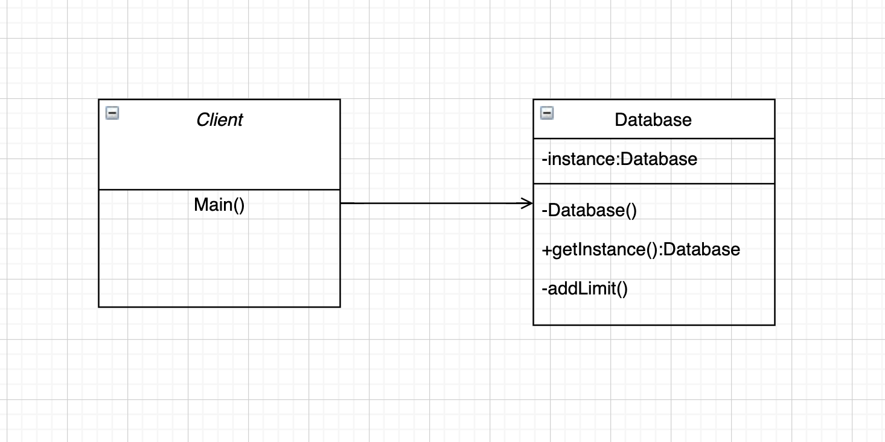
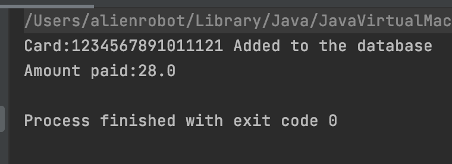
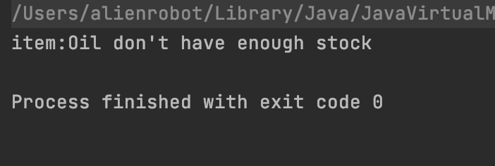
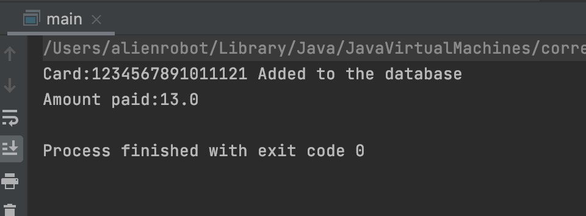

# CMPE202-individual

### Instructions to run the porject

Run CMPE202/src/com.examle/main

### Design pattern 

The design pattern I used is singleto, I put the inventory in the database class. It has a private deafault consturctor and every time main need to use the database it retunr the same database object 

### Class diagram

### Output for Input1

### Output for Input2

### Output for Input3

